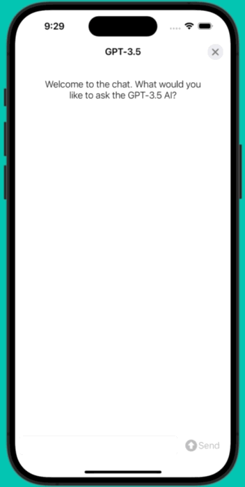

# iOS MVVM-C Template Chat Project

## Overview
This project serves as a template for building iOS applications with a chat feature, using Swift and UIKit with the Model-View-ViewModel-Coordinator (MVVM-C) architecture. The focus of this template is to strike a balance between simplicity and a clean separation of concerns, facilitating the rapid development of features with a structure that is straightforward to understand and test.

The app implements 1-1 chat backed by a "dummy" chat or a "ChatGPT" chat. The first screen allows the user to select between these two chats, with an API key required to be entered for the GPT chat (note that there is not currently any validation of whether the API key is correct or not).

 

Key Features:
* MVVM-C Architecture: Demonstrates the use of MVVM-C, enhancing the scalability and maintainability of the app.
* Testability: With separated concerns, the project is structured to simplify unit testing and UI testing (though no real UI tests are currently implemented).
* Chat: Back and forth chat between the user and an "AI" whether that's a "dummy" or "GPT". Easily extendable to other backends/APIs.
* CI: Bitrise has been configured to build this project to allow for automatic running of unit tests whenever the code changes.

Considerations:
* This project uses UIKit, while SwiftUI is certainly an option, UIKit changes less frequently and will allow for reduced maintenance of this project.
* Dependency management is not used as there is currently no need for third party libraries, however Swift Package Manager or Cocoapods could easily be used.
